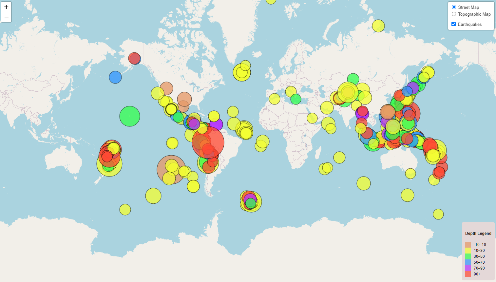

<h1 align="center">USGS Earthquake Map</h1>

## Background:

### The USGS gathers different amounts of data from natural disasters, environmental health, and climate change. The USGS has begun a project in creating new tools to visualize collected eartquake data to help bring awareness to the world. I was tasked with finding a solution in generationg better map visualizations for the USGS eathquake data. I worked on the data from 4.5+ magnitude earthquake data in the past 30 days. 

## 4.5+ Magnitude Earthquake In The Past 30 Days

## Methods:
### HTML
### CSS
### JavaScript
### Leaflet
